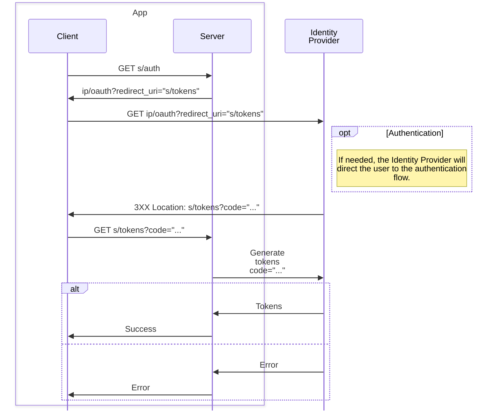

# OAuth2

Let's say a user holds an identity with a cartain Identity Provider (Google, Facebook, ecc) and wants to authorize our App to use that identity. The App is split between a Client (a Frontend, a mobile app, or even a bunch of loose pages exposed by the Backend directly) and a Server.

We will use `s` and `ip` as placeholders for the URL of, respectively, the Server and the Identity Provider.

- The Server needs to expose some way (e.g. and endpoint `s/auth`, or a GraphQL query) to get the OAuth2 URL. Most Identity Providers provide libraries to compose this URL automatically.
- The Server needs to expose some callback endpoint (e.g. `s/tokens`) through which to receive the tokens from the Identity Provider.

The Success/Error can be as simple as a static page hosted by the Server. For a better user experience you can *cleverly* use redirects and some state saved locally on the Client to make the flow end up directly on the page the user meant to reach.
